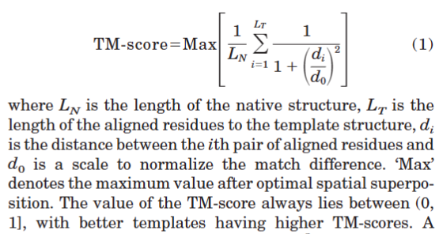
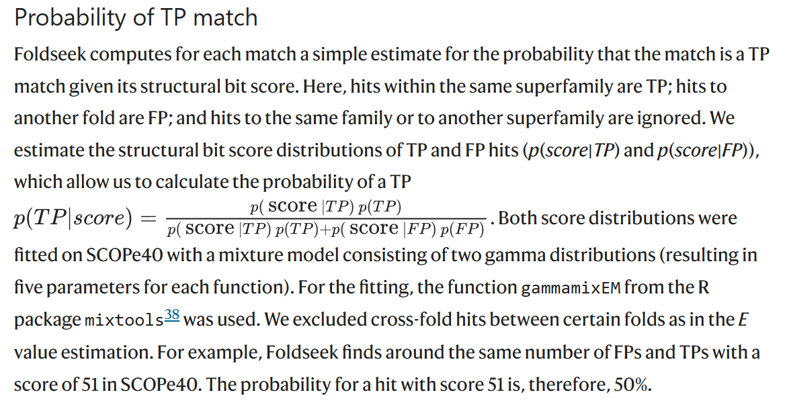

# Assessment 

## TM-score
> Zhang Y, Skolnick J. Scoring function for automated assessment of protein structure template quality. Proteins. 2004 Dec 1;57(4):702-10. doi: 10.1002/prot.20264. Erratum in: Proteins. 2007 Sep 1;68(4):1020. PMID: 15476259.

## E-value
how randomly you find this structure. How likely you find this match just by chance.

## Prob

## pLDDT
"**p**redicted **L**ocal **D**istance **D**ifference **T**est" is a per-residue measure of local confidence. It is scaled from 0 to 100, with higher scores indicating higher confidence and usually a more accurate prediction. [ref](https://www.ebi.ac.uk/training/online/courses/alphafold/inputs-and-outputs/evaluating-alphafolds-predicted-structures-using-confidence-scores/plddt-understanding-local-confidence/#:~:text=The%20predicted%20local%20distance%20difference,usually%20a%20more%20accurate%20prediction.)

## PAE
**P**redicted **A**ligned **E**rror (PAE) is a measure of how confident AlphaFold2 is in the relative position of two residues within the predicted structure. PAE is defined as the expected positional error at residue X, measured in Ångströms (Å), if the predicted and actual structures were aligned on residue Y.[ref](https://www.ebi.ac.uk/training/online/courses/alphafold/inputs-and-outputs/evaluating-alphafolds-predicted-structures-using-confidence-scores/pae-a-measure-of-global-confidence-in-alphafold-predictions/)
