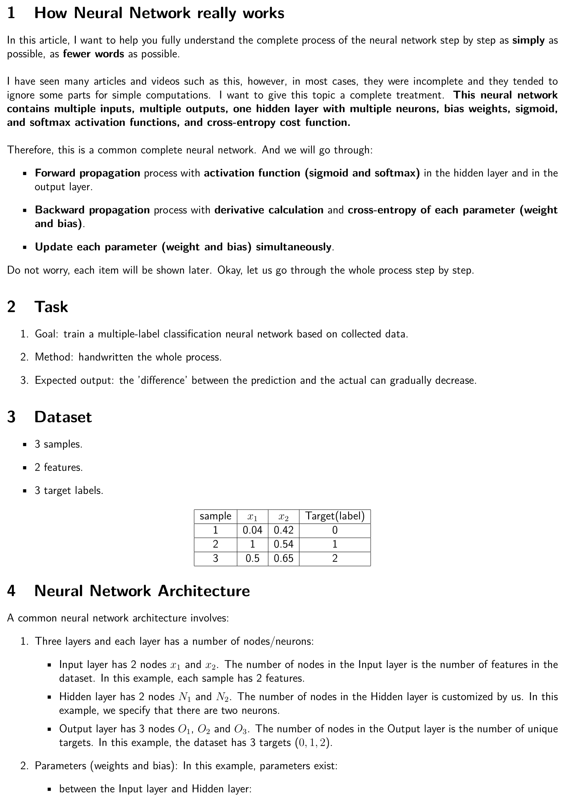
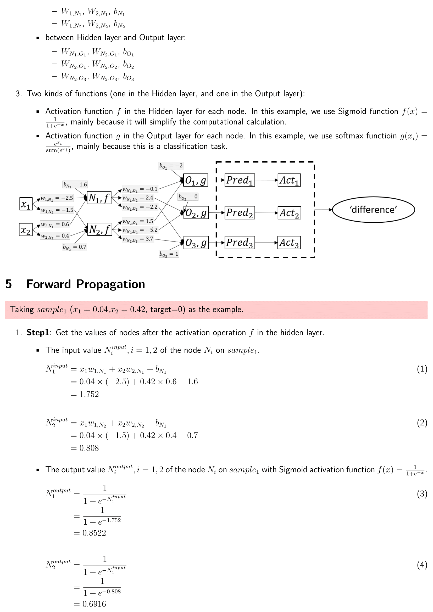
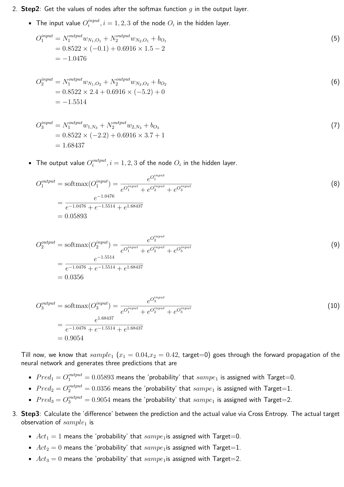
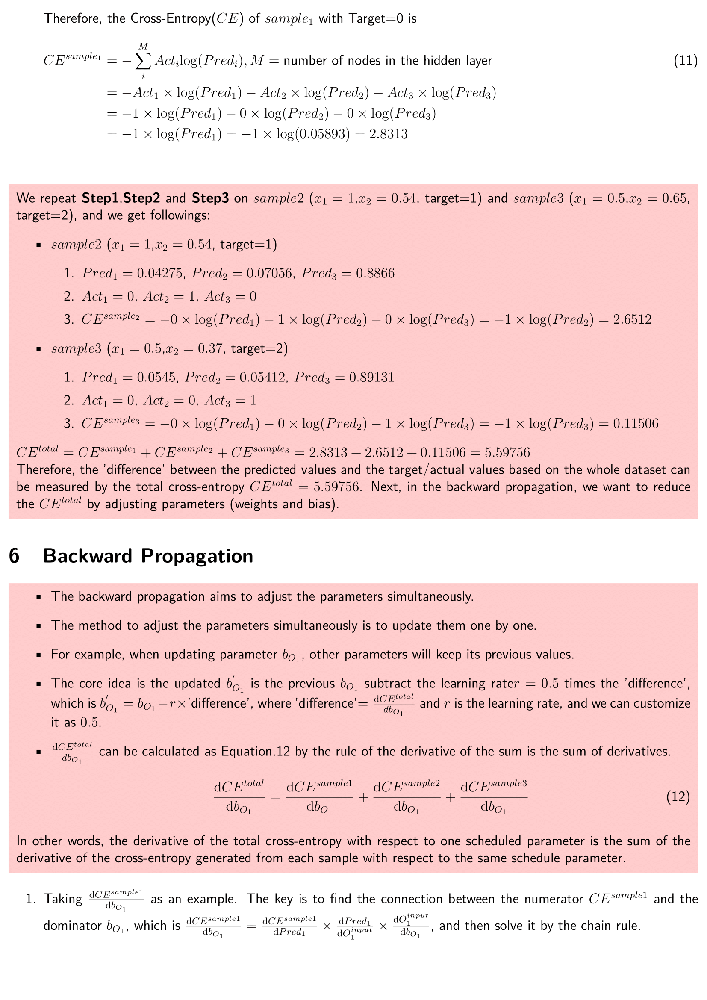
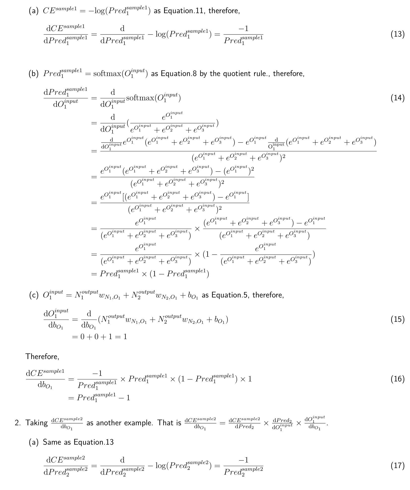
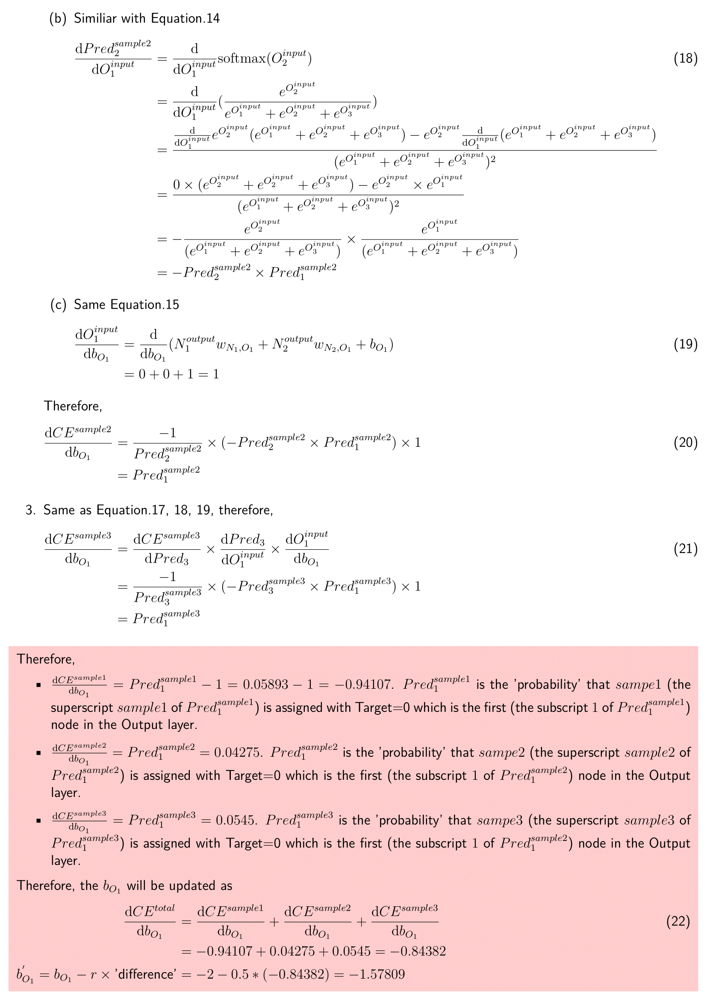
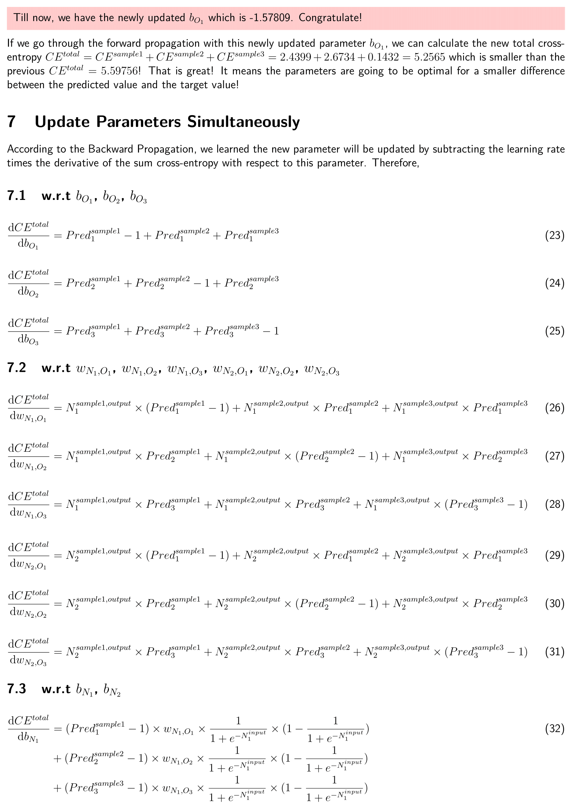
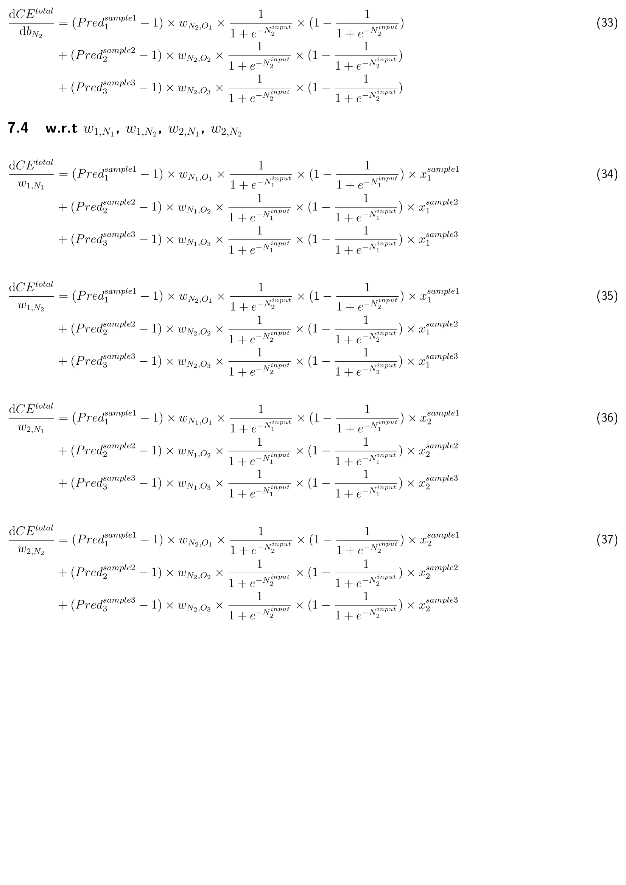

# A Deep learning Neural Network from the scratch via Numpy/Pandas

The basic complete deep learning neural network architecture includes:
- Forward propagation process with activation function (sigmoid and softmax) in the hidden layer and output laryer.
- Backward propagation process with derivative calculation and cross-entropy of each parameter (weight and bias).
- Update each parameter (weight and bias) simultaneously.

## Task
1. Goal: train a multiple-label classification neural network based on collected data.
2. Method: handwritten the whole process.
3. Expected output: the "difference" between the prediction and the reality can gradually decrease.

## Dataset
3 samples, 2 features, 3 target labels.

| Sample        | \\(x_1\\) | \(x_2\)  | Target (label) |
| ------------- | ------------- | ------------- | ------------- |
| 1  | 0.04  | 0.42  | 0  |
| 2  | 1 | 0.54  | 1  |
| 3  | 0.5  | 0.65  | 2  |

## Neural Network architecture

