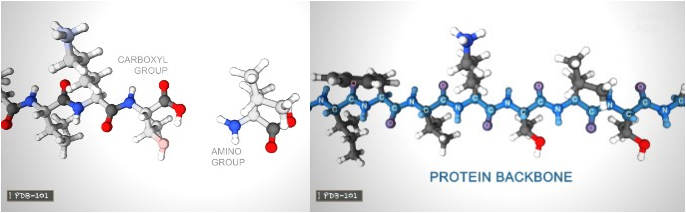

#

1. Proteins are polymers -- loong and chain-like moleculars.
2. mRNA encodes a polypeptide. (mRNA codes fro a polypeptide)
3. A linear chain of amino acid residues is called a <mark>polypeptide</mark>.
4. Short polypeptides, containing less than 20–30 residues, are rarely considered to be proteins and are commonly called <mark>peptides</mark>.
5. The amino acids in a polypeptide chain are linked by <mark>peptide bonds</mark> between amino (-NH2) and carboxyl group (-COOH). 
6. An individual amino acid in a chain is called a <mark>residue</mark>.
7. A polypeptide chain ends with a free amino group, known as the N-terminus or amino terminus (positively charged), and a free carboxyl group, known as the C-terminus or carboxy terminus(negatively charged). <mark>polarity</mark>
8. All proteins are made of 21 amino acids.

These amino acids can be divided into three groups based on their properties determnined by their side chains:
- Hydrophobic: carbon-rich side chains which don't interact well with water.
- Hydrophilic/Polar: iteract well with water.
- Charged: iteract with oppositely charded amino acids or other molecules.

  <figure>
    
  </figure>

9. Each amino acide is made of Carbon, Oxyden, Nitrogen, Hydrogen atoms. And some have sulfur atoms too.

  <figure>
    
  </figure>

10. These atoms form an <mark>Amino group (-NH2)</mark>, a <mark>Carboxyl group (-COOH)</mark> and a <mark>Side chain (-R)</mark>. These three groups are attached to a central carbon atom, called Alpha Carbon α-carbon.

  <figure>
    
  </figure>

11. A protein can be composed of one or more polypeptides. 
12. beta-strand vs beta-sheet
13. Primary structure
> Linear sequence of amino acids encoded by DNA. Amino acids are joined by peptide bonds, happending between -COOH and -NH2. A water H2O molecule is released each time a bond is formed. The linked series of carbon, nitrogen and oxygen atoms make up the <mark>protein backbone</mark>

  <figure>
    
  </figure>

14. Secondary structure
> Alpha helix and Beta sheet
15. Tertiary structure
> 3D shape of the protein
16. Quaternary structure
> Two or more polypeptide chains come together to form one fucntional molecule wih several subunits.

### reference
- Molecular biology (Molecular Biology 5th (Fifth) Edition, Robert Weavers, [amazon](https://www.amazon.com/Molecular-Biology-Fifth-Robert-Weaver/dp/B006YTUAMY))
- https://en.wikipedia.org/wiki/Protein
- https://pdb101.rcsb.org/learn/videos

