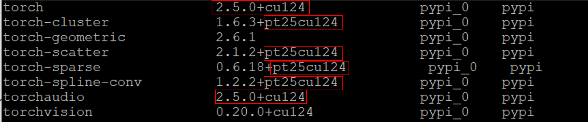

## Environment Setup

<div class="warning">

**Important setup:**

torch, torch_geometric and their dependencies: torch_scatter and torch_cluster

</div>

1. `conda create -n plienv python=3.9.18`

2. `nvcc -V`
```
nvcc: NVIDIA (R) Cuda compiler driver
Copyright (c) 2005-2024 NVIDIA Corporation
Built on Thu_Sep_12_02:18:05_PDT_2024
Cuda compilation tools, release 12.6, V12.6.77
Build cuda_12.6.r12.6/compiler.34841621_0
```

3. `python`
```
Python 3.9.18 (main, Sep 11 2023, 13:41:44)
[GCC 11.2.0] :: Anaconda, Inc. on linux
Type "help", "copyright", "credits" or "license" for more information.
>>>
```

4. https://pytorch.org/get-started/previous-versions/
```
pip install torch==2.5.0 torchvision==0.20.0 torchaudio==2.5.0 --index-url https://download.pytorch.org/whl/cu124
```

5. https://pytorch-geometric.readthedocs.io/en/latest/install/installation.html

```
pip install torch_geometric

pip install pyg_lib torch_scatter torch_sparse torch_cluster torch_spline_conv -f https://data.pyg.org/whl/torch-2.5.0+cu124.html

```

<div class="warning">

**IMPORTANT:**

1. Both PyG and PyTorch must be installed via `pip`

2. PyTorch and CUDA version must be same.

3. PyTorch installation must be through Wheel not Conda.

4. PyTorch 2.5.1 doesn't work with PyG 2.5.0.


<center>
  <figure>
    
  </figure>
</center>


</div>


6. `pip install e3nn`
7. `pip install fair-esm`
8. `pip install rdkit-pypi`
9. `pip install biopython`
10. `pip install ProDy`
11. `pip install matplotlib`
12. `pip install pandas`
13. `pip install PyYAML`
