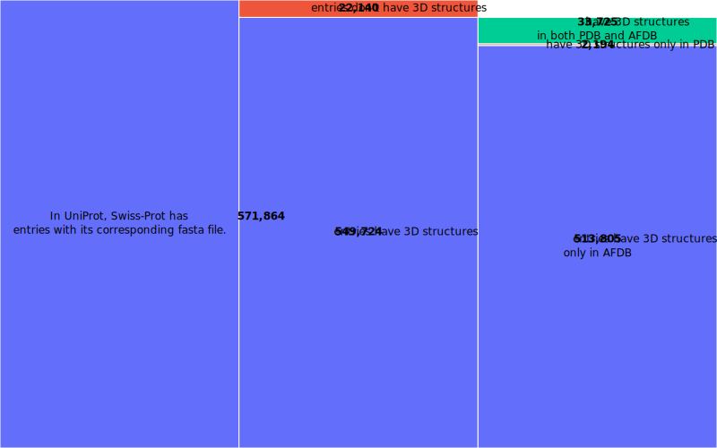

- PDB database
- Swiss-Prot database (AI-predicted structures)
- OMG_Prot50 (Proteins are transcribed from the Open MetaGenomic.)


## PDB database
### download
1. https://files.rcsb.org/pub/pdb/data/structures/all/pdb/
2. save this website as *PDB - FTP Archive over HTTP.html*
3. extract *pdbXXXX.ent.gz* list
```python
from bs4 import BeautifulSoup
# how many ent.gz file
with open('PDB - FTP Archive over HTTP.html', 'r') as file:
    html_content = file.read()
    
soup = BeautifulSoup(html_content, 'lxml')
text = soup.get_text('\n', '\n\n')
lines = text.split('\n')

PDB_id_list = []

for line in lines:
    if 'ent.gz' in line:
        PDB_id_list.append(line.split(".")[0][4:] #.split("pdb")[1])
# PDB_id_list[:5]
# ['100d', '101d', '101m', '102d', '102l']
```

> It's not okay to extract *id* by `.split("pdb")`. Because *pdb* might be also the part of the *id* in some special cases, for example, *pdb1pdb.ent.gz*.

4. parallel downloads
```python
# split into 44 entry_i.txt file
length = 5000
count = len(df)//length
for i in range(43):
    subdf = df.iloc[i*5000:i*5000+5000]
    sublist =subdf["id"].tolist()
    string = ",".join(sublist)
    text = open('groups/entry_'+ str(i)+'.txt', 'w')
    text.write(string)
    text.close()

final_sublist = df.iloc[43*5000:43*5000+5000]["id"].tolist()
finalstring = ",".join(final_sublist)
finaltext = open('groups/entry_'+ str(43)+'.txt', 'w')
finaltext.write(finalstring)
finaltext.close()
```
 Obatin the batch-download script **batch_download.sh** from [Batch Downloads with Shell Script](https://www.rcsb.org/docs/programmatic-access/batch-downloads-with-shell-script)

```shell
#!/bin/bash
cd /(your path)

for line in $(cat ./../groups/entry_list.txt); do
   ./../batch_download.sh -f ./../groups/${line} -p &
done
```
where *entry_list.txt* has *entry_i.txt* line by line.
```shell
$ bash parallel_download.sh > download.log 
```

> *Failed download* is common when Shell script downloads large files simutaneously. Therefore, it is important to check whether the script has downloaded the complete and correct *ent.gz* files. For example, by `gunzip *gz`, the wrong *.gz* files will output `unzip error`. And then, this wrong *.gz* file should be removed and we need to download it again.

### desciption
At this moment, I download 218,546 PDB entries from PDB database. 


## Swiss-Prot database
### download
[UniProt](https://www.uniprot.org/uniprotkb?query=*&facets=reviewed%3Atrue) provides the reviewed Swiss-Prot database.

### [Unipressed](https://github.com/multimeric/Unipressed) API client

### description
In *UniProt*,  Swiss-Prot has 571,864 entries with its corresponding fasta file. 549,724 entries have 3D struture. And most (513,805) of these structure are from AlphaFold prediction.


<center>
  <figure>
    
  </figure>
</center>

## OMG_Prot50 database
### download
[huggingface.co/datasets/tattabio/OMG_prot50](https://huggingface.co/datasets/tattabio/OMG_prot50?sql=--+The+SQL+console+is+powered+by+DuckDB+WASM+and+runs+entirely+in+the+browser.%0A--+Get+started+by+typing+a+query+or+selecting+a+view+from+the+options+below.%0ASELECT+*+FROM+train+LIMIT+10%3B)

### description
> The `OMG_prot50` dataset is a protein-only dataset, created by clustering the Open MetaGenomic dataset (OMG) at 50% sequence identity.
> MMseqs2 linclust (Steinegger and Söding 2018) was used to cluster all 4.2B protein sequences from the OMG dataset, resulting in 207M protein sequences. Sequences were clustered at 50% sequence id and 90% sequence coverage, and singleton clusters were removed.