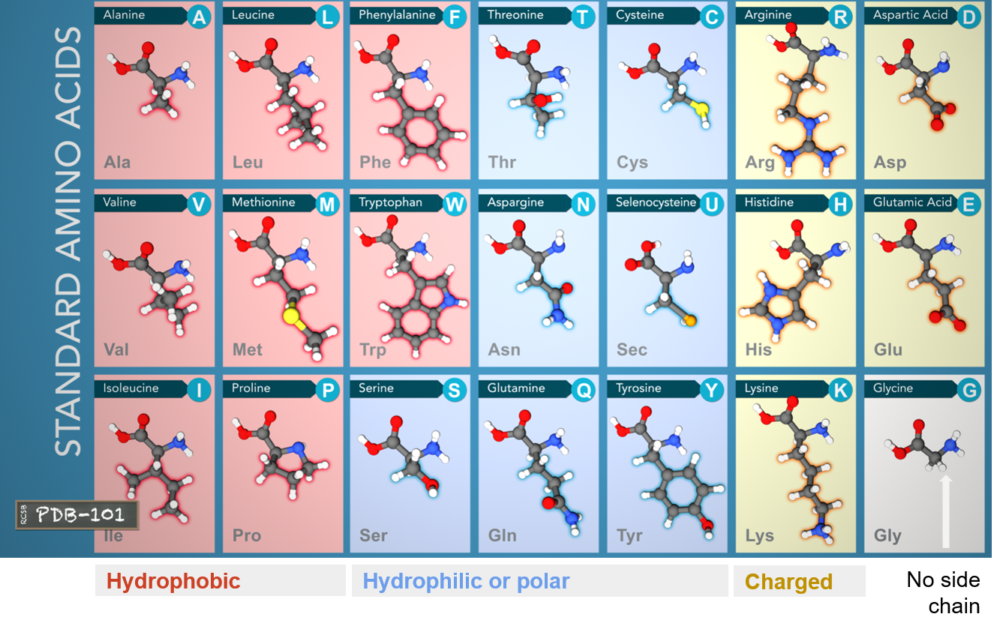

# Protein ([PDB-101](https://pdb101.rcsb.org/learn/videos))

> from https://en.wikipedia.org/wiki/Protein
> - A linear chain of amino acid residues is called a <mark>polypeptide</mark>.
> -  Short polypeptides, containing less than 20–30 residues, are rarely considered to be proteins and are commonly called <mark>peptides</mark>.
> - The amino acids in a polypeptide chain are linked by <mark>peptide bonds</mark> between amino (-NH2) and carboxyl group (-COOH). 
> - An individual amino acid in a chain is called a <mark>residue</mark>.
> - A polypeptide chain ends with a free amino group, known as the N-terminus or amino terminus, and a free carboxyl group, known as the C-terminus or carboxy terminus

All proteins are made of 21 amino acids.

  <figure>
    
    <figcaption>ref: https://pdb101.rcsb.org/learn/videos </figcaption>
  </figure>

Each amino acide is made of Carbon, Oxyden, Nitrogen, Hydrogen atoms. And some have sulfur atoms too.

  <figure>
    
    <figcaption>ref: https://pdb101.rcsb.org/learn/videos </figcaption>
  </figure>

These atoms form an <mark>Amino group (-NH2)</mark>, a <mark>Carboxyl group (-COOH)</mark> and a <mark>Side chain (-R)</mark>. These three groups are attached to a central carbon atom, called Alpha Carbon α-carbon.

  <figure>
    
    <figcaption>ref: https://pdb101.rcsb.org/learn/videos </figcaption>
  </figure>

These amino acids can be divided into three groups based on their properties determnined by their side chains:
- Hydrophobic: carbon-rich side chains which don't interact well with water.
- Hydrophilic/Polar: iteract well with water.
- Charged: iteract with oppositely charded amino acids or other molecules.

## Structure

### Primart structure
> Linear sequence of amino acids encoded by DNA

Amino acids are joined by peptide bonds, happending between -COOH and -NH2. A water H2O molecule is released each time a bond is formed.

  <figure>
    
    <figcaption>ref: https://pdb101.rcsb.org/learn/videos </figcaption>
  </figure>

The linked series of carbon, nitrogen and oxygen atoms make up the <mark>protein backbone</mark>

  <figure>
    
    <figcaption>ref: https://pdb101.rcsb.org/learn/videos </figcaption>
  </figure>

### Secondary structure
> Alpha helix and Beta sheet

  <figure>
    
    <figcaption>ref: https://pdb101.rcsb.org/learn/videos </figcaption>
  </figure>

  <figure>
    
    <figcaption>ref: https://pdb101.rcsb.org/learn/videos </figcaption>
  </figure>

### Tertiary structure
> 3D shape of the protein

  <figure>
    
    <figcaption>ref: https://pdb101.rcsb.org/learn/videos </figcaption>
  </figure>

### Quaternary structure
> Two or more polypeptide chains come together to form one fucntional molecule wih several subunits.
