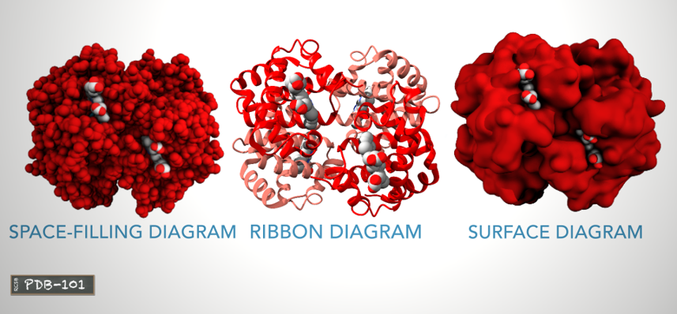

# Protein visual representation

  <figure>
    
    <figcaption>ref: https://pdb101.rcsb.org/learn/videos </figcaption>
  </figure>

- Space-filling diagram:
    - shows all atoms
- Ribbon/Cartoon diagram:
    - shows the protein backbone and highlights the alpha helices.
- Surface diagram:
    - shows areas that are accessible to water molecules.