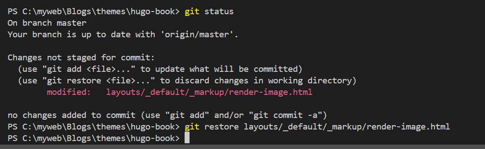

So..., I find I used these codes a lot.

## 

```
while IFS= read -r line; do
   python ./../PDB_ana.py ${line} /../test_clean/ 
done < <(grep "" ./pdb.txt)
```


```shell
ls -l | wc -l

wget -i links.txt -o wget.log

tar -tzf file.tar.gz | wc -l # count files in tar.gz without unzip # it actually counts lines, and it will cause counting \n as a line

tar -zcvf  myfolder.tar.gz myfolder

cp ./folder/*.txt ./newfolder

gunzip *.gz # for f in *.gz; do gunzip "$f"; done

cat *.fa > all_data.fa # concatenate multiple fasta files into one fasta file in command line

source ~/miniconda3/etc/profile.d/conda.sh
conda activate SE3nv
```


```shell
PDBdb_dir_has=()
for pdb_fp in $PDBdb_dir*pdb; do
    pdb=$(basename $pdb_fp .pdb)
    PDBdb_dir_has+=($pdb)
done
```

```shell
A=()
lines=`cat $AFDB_pLDDT_70_log`
for line in $lines; do
    if [[ $line  == *".pdb" ]]; then
        entry=$(echo "$line" | cut -d "." -f 1)
        A+=($entry)
    fi
done
```


## How to discard changes in VScode?
Navigate to reporsitory (has `.github` folder) with changes. Then, `git restore <file>`
<p></p>

## Activate conda environment in bash script
```console
source ~/miniconda3/etc/profile.d/conda.sh
conda activate ENV
```
## SBATCH Array jobs
```console
#SBATCH -J array-job					
#SBATCH -a 1-3
#SBATCH -o array-job.%A.%a.log

id_list="./id_list.txt"
id=`head -n $SLURM_ARRAY_TASK_ID $id_list | tail -n 1`
python3 script.py -in $id
```

## srun gpu
```console
srun -N 1 --ntasks-per-node 2 -p v100 -q gpu --gres=gpu:1 --mem=50G --pty /bin/bash
```

## run scripts
```console
sbatch test.slm
```

## check sequence process
```console
squeue -u username
```
## cancel sequence
```console
scancel jobID
```

## copy files into another folder
```console
cp ./*.pdb ../newfoler
```

## count files in a directory in command line
```console
cd directory
ls -l | wc -l
```
## 
```shell
# get .gz files
wget -r -np -e robots=off -A 'pep.all.fa.gz' https://ftp.ensembl.org/pub/current_fasta/ 
```

```shell
stat_gpu # check available  partition

srun -q gpu -p v100-af --mem=50G --gres=gpu:1 --pty /bin/bash # access one gpu

tar xvzf file.tar.gz # unzip

module load igv # access specific place

ls -1 | wc -l # count files in a directory in linux

```

<p></p>