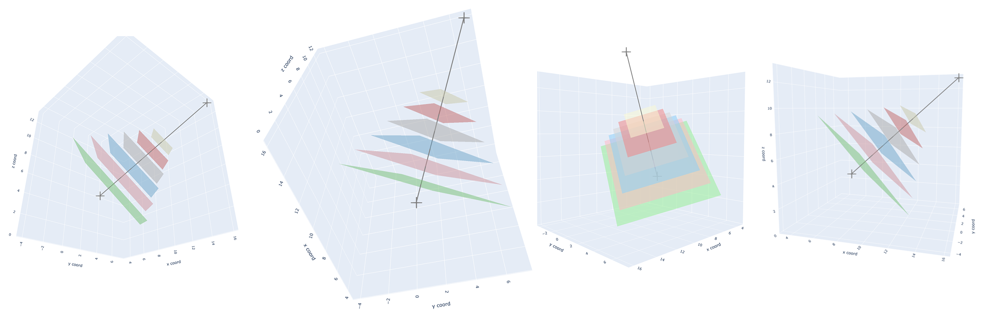
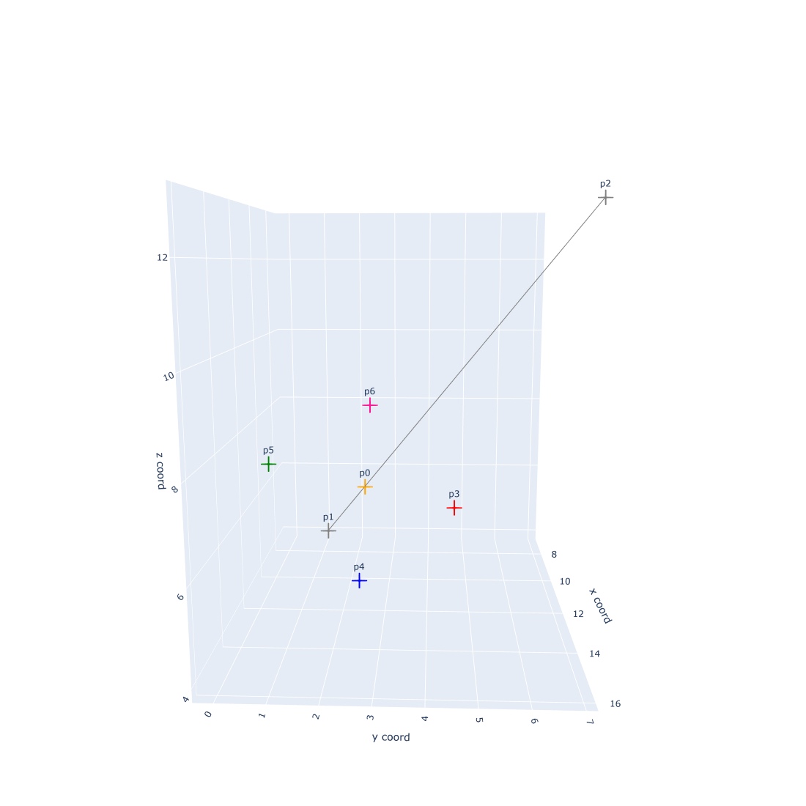
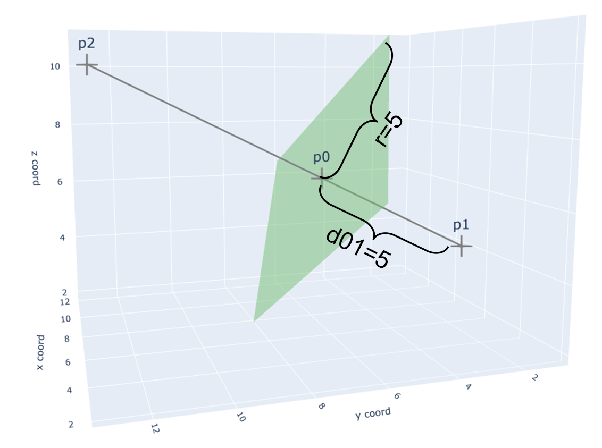

# Plotly: Drawing a plane perpendicular to a given line

1. Explanation
2. Example

When I was working on my binder design task, I need to select suitable hotspot residues that can lead to design better binders. In addition to hydrophobic amino acids, I also want to focus on the amino acids whose positions are close to the outside edge, and far away from the center of the protein. Therefore, I expect a plane that can approximately cut the protein layer by layer with my expected distance to the outside edge.

By calculating the centers of two parts of my protein, I can easily determine one line. However, it took me much time to find the plane that can be perpendicular to this line.

Finally, I find the solution! 


<div align="center">

<p><em>Planes perpendicular to the given line</em></p>
</div>

## Explanation

Assuming that we want to make a plane whose vertical distance to \\(p_1\\) is \\(d_{01}\\). We can determine the point \\(p_0\) by 
```python
from shapely.geometry import LineString

line = LineString([p1, p2])
p0_tmp = line.interpolate(d01)
p0 = np.array([p0_tmp.x, p0_tmp.y, p0_tmp.z])
```

<div align="center">

<p><em>5 important points who determine the plane</em></p>
</div>


Finding \\(p_3\\), \\(p_4\\), \\(p_5\\) and \\(p_6\\) took me lots of time. I finally find that they can be found by vector calculation. 
For example, we want the distance between \\(p_0\\) and \\(p_3\\) or \\(p_4\\) or \\(p_5\\) or \\(p_6\\) is \\(Radius = 3\\). 

```python
P1 = p0
P2 = p2
Radius = 3
V3 = P1 - P2
V3 = V3 / np.linalg.norm(V3)
e = np.array([0,0,0])
e[np.argmin(np.abs(V3))] = 1
V1 = np.cross(e, V3)
V1 = V1 / np.linalg.norm(V3)
V2 = np.cross(V3, V1)
# p3 90 degree
s3 = np.pi/2
p3 = P1 + Radius*( np.cos(s3)*V1 + np.sin(s3)*V2 ) 
# p4 180 degree
s4 = np.pi
p4 = P1 + Radius*( np.cos(s4)*V1 + np.sin(s4)*V2 ) 
# p5 270 degree
s5 = np.pi*1.5
p5 = P1 + Radius*( np.cos(s5)*V1 + np.sin(s5)*V2 )
# p6 0 degree
s6 = 0
p6 = P1 + Radius*( np.cos(s6)*V1 + np.sin(s6)*V2 )
```

Becasue three points determine one plane. We can finally make the plane by
```python
plane1_x, plane1_y, plane1_z = np.array([p6, p3, p5]).T
fig.add_trace(go.Mesh3d(x=plane1_x, y=plane1_y, z=plane1_z, color="lightgreen", name = "", hoverinfo="skip", opacity=0.50))

plane2_x, plane2_y, plane2_z = np.array([p4, p3, p5]).T
fig.add_trace(go.Mesh3d(x=plane2_x, y=plane2_y, z=plane2_z, color="lightgreen", name = "", hoverinfo="skip", opacity=0.50))
```

## Example

1. `import` libraries

```python
import numpy as np
from random import randrange
import random
import pandas as pd
from shapely.geometry import LineString
import plotly.express as px
import plotly.graph_objects as go
```

2. There are two points \\(p_1\\) and \\(p_2\\), and I want a plane who is perpendicular to the line  \\( (p_1,p_2) \\) at the point  \\(p_0\\). The vertical distance between \\(p_1\\) to this plane is the distance between \\(p_1\\) and \\(p_0\\), \\(d_{01}=4\\).

```python
random.seed(25)

p1 = np.array([randrange(1,10) for i in range(3)])
p2 = np.array([randrange(3,15) for i in range(3)])

d01 = 5
```

3. Half the length of the diagonal of the square plane is \\(r=5\\)

```python

def drawing(p1, p2, d01, r):
    # p0 position
    line = LineString([p1, p2])
    p0_tmp = line.interpolate(d01)
    p0 = np.array([p0_tmp.x, p0_tmp.y, p0_tmp.z])
    # preparation
    P1 = p0
    P2 = p2
    Radius = r
    V3 = P1 - P2
    V3 = V3 / np.linalg.norm(V3)
    e = np.array([0,0,0])
    e[np.argmin(np.abs(V3))] = 1
    V1 = np.cross(e, V3)
    V1 = V1 / np.linalg.norm(V3)
    V2 = np.cross(V3, V1)

    # p3 90 degree
    s3 = np.pi/2
    p3 = P1 + Radius*( np.cos(s3)*V1 + np.sin(s3)*V2 ) 
    # p4 180 degree
    s4 = np.pi
    p4 = P1 + Radius*( np.cos(s4)*V1 + np.sin(s4)*V2 ) 
    # p5 270 degree
    s5 = np.pi*1.5
    p5 = P1 + Radius*( np.cos(s5)*V1 + np.sin(s5)*V2 )
    # p6 0 degree
    s6 = 0
    p6 = P1 + Radius*( np.cos(s6)*V1 + np.sin(s6)*V2 )
    
    # draw
    ## line
    fig = go.Figure(data =[go.Scatter3d(x=[p1[0],p2[0]], y=[p1[1], p2[1]],z=[p1[2], p2[2]],
                                        mode = "markers+lines+text",
                                        marker=dict(color="gray", size=15, symbol="cross"),
                                        line=dict(color="gray", width=5),
                                        text=["p1", "p2"],
                                        textfont=dict(size=20))])
    ## plane
    plane1_x, plane1_y, plane1_z = np.array([p6, p3, p5]).T
    fig.add_trace(go.Mesh3d(x=plane1_x, y=plane1_y, z=plane1_z, color="lightgreen", name = "", hoverinfo="skip", opacity=0.50))
    
    plane2_x, plane2_y, plane2_z = np.array([p4, p3, p5]).T
    fig.add_trace(go.Mesh3d(x=plane2_x, y=plane2_y, z=plane2_z, color="lightgreen", name = "", hoverinfo="skip", opacity=0.50))
    
    fig.update_layout(
        width=1100, height=1100,
        scene=dict(xaxis_title='x coord',yaxis_title='y coord',zaxis_title='z coord'),showlegend=False)
    #fig.show()
    
    # ddataframe
    df = pd.DataFrame(columns=["name", "x", "y", "z", "c"])
    df["name"] = ["p0", "p1", "p2", "p3", "p4", "p5", "p6"]
    df["x"] = [p0[0], p1[0], p2[0], p3[0], p4[0], p5[0], p6[0]]
    df["y"] = [p0[1], p1[1], p2[1], p3[1], p4[1], p5[1], p6[1]]
    df["z"] = [p0[2], p1[2], p2[2], p3[2], p4[2], p5[2], p6[2]]
    df["c"] = ["orange", "gray", "gray", "red", "blue", "green", "deeppink"]

    fig.add_trace(
        go.Scatter3d(x = [p0[0]],
                     y = [p0[1]],
                     z = [p0[2]],
                     mode ='markers+text',
                     marker=dict(color="gray", size=15, symbol="cross"),
                     text=["p0"],
                     textfont=dict(size=20)))


    

    fig.show()


    
    return df
    
df = drawing(p1=p1, p2=p2, d01=d01, r=5)
```

<div align="center">

<p><em>A square plane perpendicular to a line</em></p>
</div>